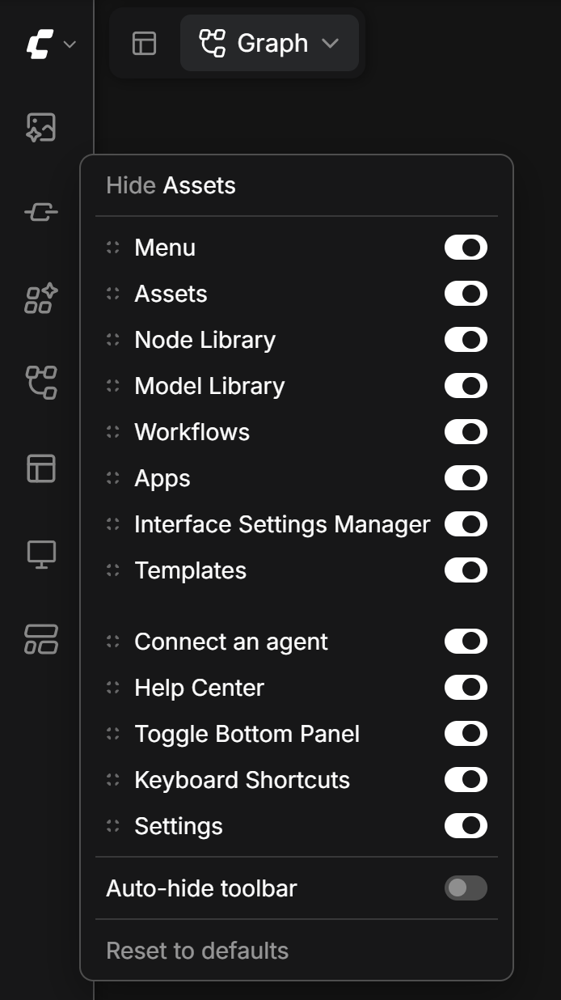

# ComfyUI Sidebar Hider

A small ComfyUI custom node (frontend extension only) that hides icons in the
left vertical sidebar toolbar.



## What it does

- Right-click anywhere on the left toolbar to open a small menu next to the cursor.
- The menu offers `Hide <item>` for the icon under the cursor.
- Below that, every toolbar icon is listed with a toggle switch, so each icon
  can be shown or hidden individually. At least one icon always stays visible.
- Drag any list row by its dotted grip to reorder the icons, within their
  group or across the top/bottom groups; the other rows slide aside while
  dragging, and the toolbar behind the menu follows live.
- `Reset to defaults` shows every icon again, restores the default order and
  turns auto-hide off.
- Clicking outside the menu or pressing `Escape` closes it.
- Optional auto-hide mode: the whole toolbar slides off-screen and slides back
  when the mouse reaches the screen edge. It never hides while a sidebar panel
  is open. The toggle is in the right-click menu and in
  Settings -> Sidebar Hider -> General -> Auto-hide toolbar.
- Nothing is hidden by default.

## Install

Copy this folder to your ComfyUI `custom_nodes` directory, for example:

```text
ComfyUI/custom_nodes/comfyui-sidebar-hider/
  __init__.py
  js/sidebarHider.js
```

Then restart ComfyUI (the backend must restart so it picks up the new
extension) and refresh the browser window.

## Files

- `__init__.py` - exposes `WEB_DIRECTORY = "./js"` so ComfyUI serves the script.
- `js/sidebarHider.js` - the whole extension: icon detection, CSS hiding,
  context menu, drag-reorder, auto-hide, settings persistence.

## Notes

- Hidden icons and the custom icon order are stored in the
  `SidebarHider.hiddenItems` and `SidebarHider.itemOrder` settings, so they
  survive reloads.
- Icon ids prefer `data-testid` and icon classes, which do not change with the
  UI language. `aria-label` is only a last-resort fallback.
- Tested against `comfyui_frontend_package` 1.52.7.
